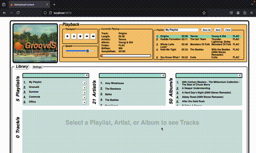

# GrooveSprings
### Music Library + Player Built With
- Akka
- portaudio
- libsndfile
- Angular
- ngrx
- Spring Boot

### Build
- frontend
  - `cd gs_desktop_application/src/main/frontend/angular/gs_desktop_frontend`
  - `npm run build-dist` 
    - outputs to folder matching current server configuration
  
- native lib
  - `cd gs-jni/src/main/java/dev/nateschieber/groovesprings/jni`
  - `make clean`
  - `make lib`
